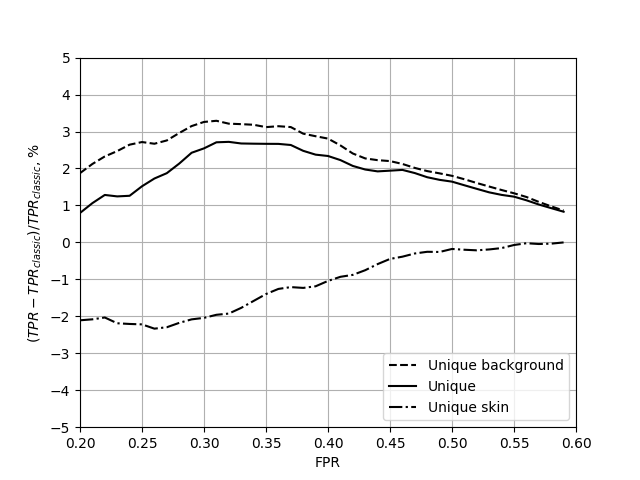

# Bayesian classifier

To improve the quality of skin segmentation in images, the new learning approach of the Bayesian classifier has been proposed. The segmentation problems arise in many applications of developing the intellectual systems based on video analysis. One of the important tasks is the human skin segmentation for further high-level processing. The most used approach is based on naive Bayesian classifier to separate human skin (foreground) pixels from the background ones. We propose the new approach for preparing learning dataset which considers only unique colors from each image to avoid normalization influence related to the size of the foreground area. It provides stable improvement of the segmentation quality based on ROC-curves comparison. The testing was conducted on the union of 4 biggest public datasets containing labeled images with human skin. The results show that the average improvement in the whole range is 1.5% and 3-5% in the most used range.

ROC curves for classical learning approach and new proposed ones:

The percent of TPR changes between proposed learning approaches and classic one:

The percent of FPR changes between proposed learning approaches and classic one:

